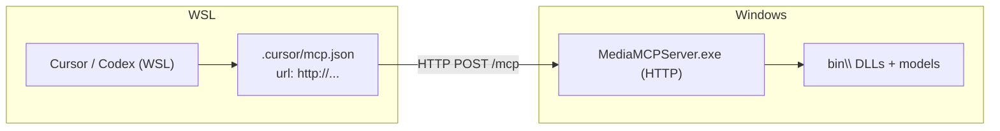

# Media-MCP-Server — WSL

Use **Streamable HTTP** when the MCP client runs in **WSL** (or Linux) but the server stays on **Windows**. The server binary is Windows-only; WSL connects over the network.

## Architecture



| Component | Where it runs |
|-----------|---------------|
| `MediaMCPServer.exe` | Windows only |
| MCP client (Cursor, Codex, …) | WSL or Windows |
| Webcam / USB camera tools | Windows host |
| File paths in tool args | Windows paths (`C:\...` or `/mnt/c/...`) |

> **stdio mode does not work** for WSL Remote workspaces: the client expects a Linux executable, not `MediaMCPServer.exe`.

---

## Quick start

### 1. Install on Windows (once)

```powershell
cd D:\Work\Delphi\MediaMCPServer
.\install.ps1
```

Or extract a production ZIP and run `.\install.ps1` there.

### 2. Start HTTP server on Windows

**WSL mirrored networking** (Windows 11 22H2+, `networkingMode=mirrored` in `.wslconfig`):

```powershell
cd bin
.\launch_http.cmd
```

**Classic NAT WSL2** (default on many setups): bind on all interfaces so WSL can reach the Windows host IP:

```powershell
cd bin
.\launch_http_wsl.cmd
```

Or use the helper (auto-detects networking, can start the server):

```powershell
.\scripts\setup_wsl_http.ps1 -StartServer -WriteSnippets
```

### 3. Configure MCP inside WSL

Open the project from WSL (e.g. `/mnt/d/Work/Delphi/MediaMCPServer`) and run:

```bash
bash scripts/setup_wsl_mcp.sh
```

The script probes `http://127.0.0.1:8765/mcp`, then falls back to the Windows host IP from `/etc/resolv.conf`.

Manual override:

```bash
bash scripts/setup_wsl_mcp.sh --host 172.22.192.1
```

### 4. Refresh MCP in the client

**Cursor:** Settings → MCP → Refresh.  
**Other clients:** see [INSTALLATION.md](INSTALLATION.md).

Expect **47 tools**.

### 5. Verify from WSL

```bash
bash scripts/tests/test_http_mcp_wsl.sh
```

---

## Networking modes

| Mode | WSL client URL | Windows server bind |
|------|----------------|---------------------|
| **Mirrored** (Win11+) | `http://127.0.0.1:8765/mcp` | `127.0.0.1` — `launch_http.cmd` |
| **NAT WSL2** | `http://<windows-host-ip>:8765/mcp` | `0.0.0.0` — `launch_http_wsl.cmd` |

### Find Windows host IP (NAT)

Inside WSL:

```bash
grep nameserver /etc/resolv.conf | awk '{print $2}'
```

From Windows PowerShell:

```powershell
.\scripts\setup_wsl_http.ps1
```

### Enable mirrored networking (optional)

Create or edit `%USERPROFILE%\.wslconfig`:

```ini
[wsl2]
networkingMode=mirrored
```

Then: `wsl --shutdown` and reopen WSL.

---

## Client configuration

### Cursor / Windsurf / Claude (WSL workspace)

`/.cursor/mcp.json` in the WSL project root:

```json
{
  "mcpServers": {
    "media-mcp-server": {
      "url": "http://127.0.0.1:8765/mcp"
    }
  }
}
```

Template: `config/mcp.wsl.http.json.template`

### OpenAI Codex (WSL)

Project `.codex/config.toml` or `~/.codex/config.toml`:

```toml
[mcp_servers.media-mcp-server]
url = "http://127.0.0.1:8765/mcp"
enabled = true
startup_timeout_sec = 30
tool_timeout_sec = 120
```

Template: `config/codex.http.wsl.config.toml.template`

### Production package

```powershell
.\install.ps1 -Mode wsl
```

Writes HTTP snippets to `config\` and `.cursor\mcp.json` with the HTTP `url` (for workspaces opened on Windows; re-run `setup_wsl_mcp.sh` from WSL for WSL Remote).

---

## Environment variables

| Variable | Default | Notes |
|----------|---------|-------|
| `MEDIA_MCP_HTTP_HOST` | `127.0.0.1` / `0.0.0.0` | Set in `launch_http*.cmd` |
| `MEDIA_MCP_HTTP_PORT` | `8765` | Same on Windows and WSL |
| `MEDIA_MCP_HTTP_PATH` | `/mcp` | |
| `MCP_HTTP_HOST` | auto | WSL test/setup scripts only |

---

## Troubleshooting

| Symptom | Fix |
|---------|-----|
| MCP red / connection refused from WSL | Start HTTP on Windows; for NAT use `launch_http_wsl.cmd` |
| Works on Windows, fails in WSL with `127.0.0.1` | Use NAT URL: `setup_wsl_mcp.sh --host $(grep nameserver /etc/resolv.conf \| awk '{print $2}')` |
| Firewall blocks WSL | Allow `MediaMCPServer.exe` on private networks, or use mirrored networking |
| stdio config with `.exe` in WSL Remote | Switch to HTTP `url` config |
| Webcam tools empty in WSL | Expected — cameras are enumerated on Windows; server must run on Windows |
| File not found in tools | Use Windows path (`D:\...`) or WSL path (`/mnt/d/...`) consistently |

Enable server logs on Windows:

```powershell
$env:MEDIA_MCP_DEBUG = "1"
cd bin
.\launch_http.cmd
```

---

## Scripts reference

| Script | Run where | Purpose |
|--------|-----------|---------|
| `scripts/setup_wsl_http.ps1` | Windows | Detect WSL networking, start HTTP, write snippets |
| `scripts/setup_wsl_mcp.sh` | WSL | Write `.cursor/mcp.json`, auto-detect URL |
| `scripts/tests/test_http_mcp_wsl.sh` | WSL | Smoke test HTTP MCP |
| `bin/launch_http.cmd` | Windows | HTTP on `127.0.0.1` (mirrored WSL) |
| `bin/launch_http_wsl.cmd` | Windows | HTTP on `0.0.0.0` (NAT WSL2) |

See also: [INSTALLATION.md](INSTALLATION.md), [DISTRIBUTION.md](DISTRIBUTION.md).
